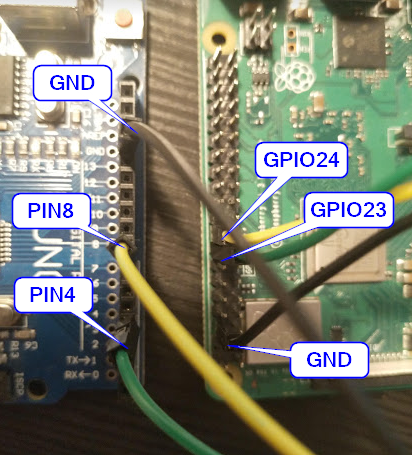

# configure the sourcecode accordingly
- configure the baudrate in main.c

# compile and flash for Atmega32
- find out your jtag device id:
- dmesg -> copy the serial number
- export `JTAG_DEVICE=YOUR_SERIAL`
- `make all.upload`

# compile and flash for Atmega328P (Arduino Uno)
- find out the port on which the Arduino is connected:
- dmesg -> something like `cdc_acm 1-6:1.0: ttyACM0: USB ACM device`
- export `TTY_PORT=/dev/ttyXXXn`
- `make all.uploadArduino`

# cabling

# testrun
- the input capture pin of your microcontroller (atmega32 uses D6, Arduino Uno Pin8) has to be connected to the output pin (atmega32 D4, Arduino Uno Pin4)
- connect to the serial line with the previous configured baudrate -> you should get an output which is 1/F_CPU
	
# start a measurement
- connect the input capture pin of your microcontroller to the output pin of the the device to be tested
- the input pin of the test candiate has to be connected to the output pin of the microcontroller
